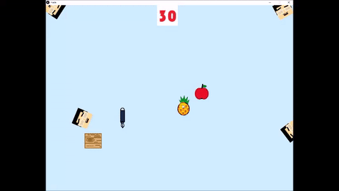
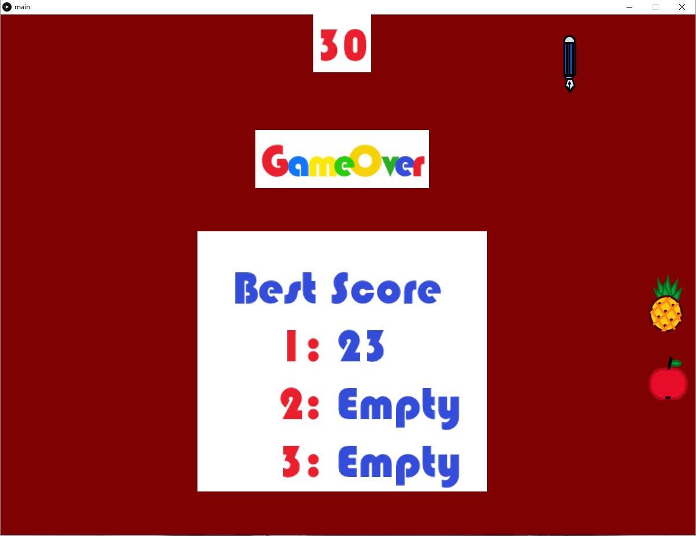

# PPAP-game v1.0.11
Initially, four enemies (Piko Taro's face) will start at the corners. In the start of the game, each enemy will go with random direction and bounce back if they hit the wall. You may win the game by directing the PEN with your mouse cursor to go through the APPLE and PINEAPPLE, and then back to the base (Wooden board) in under 30 seconds. You may lost the game by getting too close to the enemies or took more than 30 seconds to complete. In case you do not know who Piko Taro is, please go ahead and watch this [YouTube Video](https://www.youtube.com/watch?v=0E00Zuayv9Q) to learn more about him.

## Requirements
- [Processing](https://processing.org/download/)

## Demo

## Authors
[Poan Chen](https://github.com/poanchen) and Mandy.

## Disclaimer
The theme of the game is based on the YouTube video named [Pen-Pineapple-Apple-Pen/PIKO-TARO](https://www.youtube.com/watch?v=0E00Zuayv9Q) by [公式ピコ太郎歌唱ビデオチャンネル -PIKOTARO OFFICIAL CHANNEL-](https://www.youtube.com/channel/UCKpIOnsk-gcwHXIzuk24ExA).
